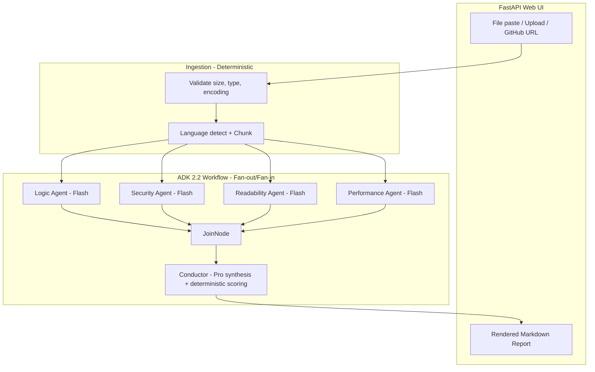

# Codessey — Agentic Code Review

Multi-agent code review system built with **Google ADK 2.2** and **Gemini 2.5** models for the GDG YorkU Hackathon.

## Architecture



## Key Design Decisions

| Decision | Rationale |
|---|---|
| ADK 2.2 Workflow with `JoinNode` | Structural match for parallel specialist dispatch; provides clean fan-out/fan-in semantics |
| `gemini-2.5-flash` for specialists | Fast + cheap for parallel calls; 25s timeout per agent |
| Groq fallback (`llama-3.1-8b-instant`) | Automatic failover when Gemini quota/billing fails |
| `gemini-2.5-pro` for Conductor synthesis only | Higher quality narrative summarization; 5s budget |
| Deterministic scoring formula | Injection-immune grades; auditable, not LLM-dependent |
| `asyncio.gather` fallback | If ADK runtime overhead exceeds 15s budget, drop to plain async parallelism |
| Graceful degradation | Partial reports with `agents_unavailable` list; `JoinNode` never stalls |

## Features

- **4 parallel specialist agents** (logic, security, readability, performance) with structured JSON output
- **Prompt-injection defense** — random delimiters, embedded instructions flagged as findings
- **SSRF-safe GitHub URL ingestion** — strict host allowlist, no redirects, size caps
- **Secret redaction** — detected API keys/credentials masked in reports
- **500-line code chunking** with 20-line overlap and cross-chunk deduplication
- **Deterministic health scoring** — `critical×15 + warning×5 + info×1` penalty formula
- **Groq fallback** — uses `GROQ_API_KEY` when Gemini is unavailable
- **CLI fallback** — `python -m app.cli review <file>` for demo-day reliability

## Setup

```bash
# 1. Install dependencies
python -m venv .venv
.venv\Scripts\activate    # Windows
# source .venv/bin/activate  # macOS/Linux
pip install -r requirements.txt

# 2. Set your API key
cp .env.example .env
# Edit .env — set GEMINI_API_KEY and/or GROQ_API_KEY (Groq works as fallback)

# 3. Run the app
python main.py
# Visit http://localhost:8000
```

## CLI Usage (demo-day fallback)

```bash
python -m app.cli review tests/test_samples/off_by_one.py
```

## Running Tests

```bash
python -m pytest tests/ -v
```

## Project Structure

```
agents/         — Specialist agents + ADK Workflow graph
schemas/        — Pydantic data models (CodeChunk, AnalysisResult, ReviewReport)
security/       — Input validation, URL allowlist, secret redaction
utils/          — Language detection, chunking, report rendering
app/            — FastAPI routes, shared review pipeline, CLI
static/         — Single-page web UI
tests/          — Unit + integration tests with sample files
```

## Limitations

- No auto-fix generation (analysis only)
- No binary file support
- No authentication/accounts (single-user demo)
- No CI/CD integration
- Language support limited to Python, JavaScript, TypeScript, Java, Go, C++

## Tech Stack

- **Orchestration:** Google ADK 2.2.0
- **Models:** Gemini 2.5 Flash (specialists), Gemini 2.5 Pro (conductor), Groq Llama 3.1 8B (fallback)
- **Backend:** FastAPI + Uvicorn
- **Frontend:** Vanilla HTML/JS (no framework)
- **Validation:** Pydantic v2
- **HTTP Client:** httpx (async, SSRF-safe)

## Team

Built for GDG YorkU Hackathon — Submit by June 24, Demo July 3.
